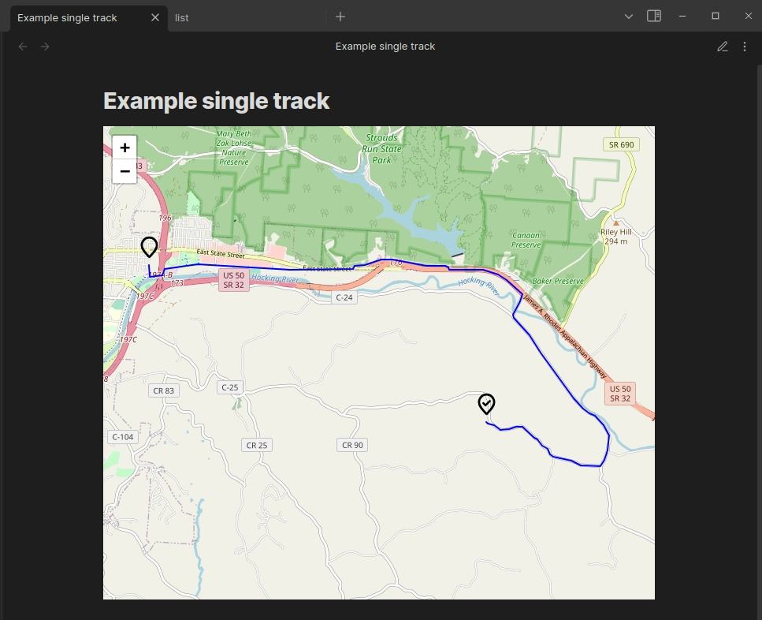
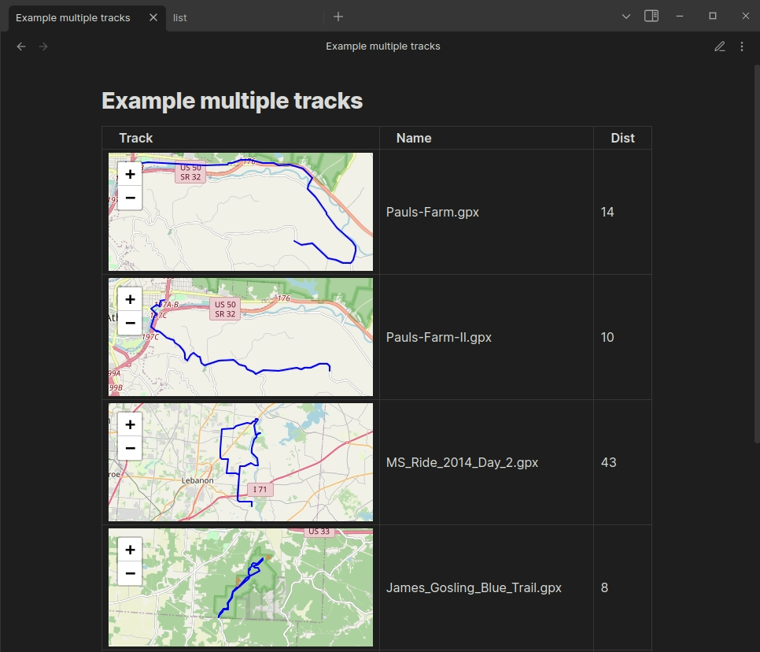
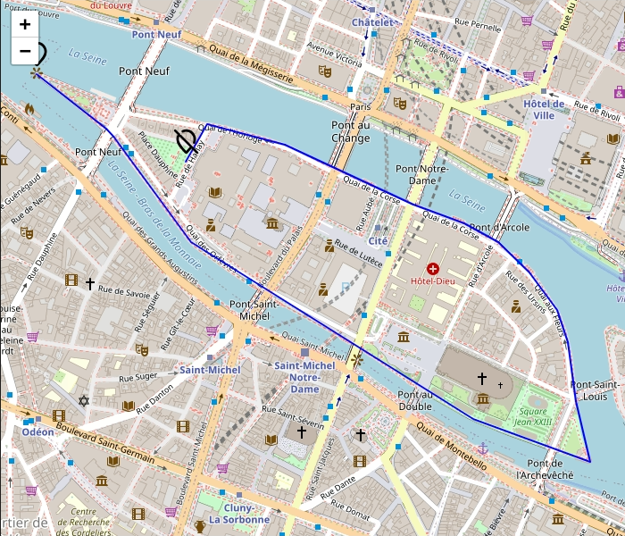
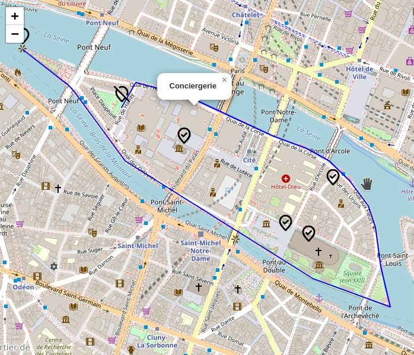
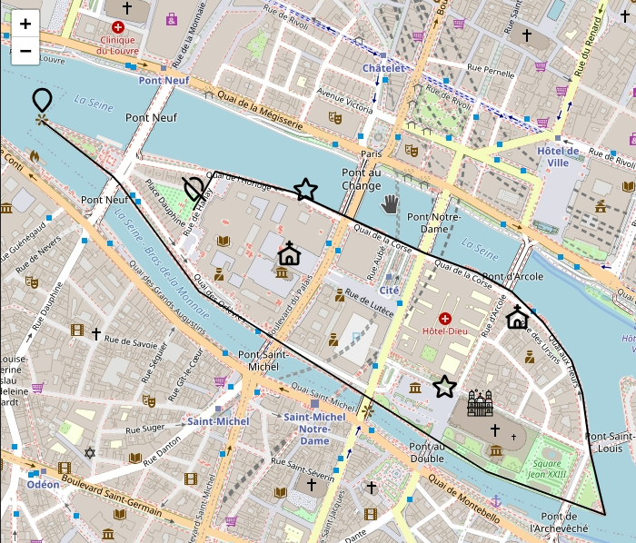

# Map GPX plugin
This plugin is used to draw a gpx track on the map.
Allows you to draw both a single track and a list of tracks from a given folder.

In his work he uses the library: [leaflet](https://github.com/Leaflet/Leaflet) and [leaflet-gpx](https://github.com/mpetazzoni/leaflet-gpx).

This is a very simple plugin that allowed me to organize my collection gpx tracks.
If you need more powerful functionality, please take a look at the plugin [obsidian-leaflet](https://github.com/javalent/obsidian-leaflet)

## Uses

### Single track

~~~markdown
```map

track: tracks/Pauls-Farm.gpx

```
~~~



### Multiple tracks

~~~markdown
```maplist

trackFolder: tracks
height: 150px

```
~~~



## Markers

To display markers on the map, you must specify them.You can download:
- **file://** - local file url
- **http://** - internet url
- **data:image** - [data url](https://developer.mozilla.org/en-US/docs/Web/HTTP/Basics_of_HTTP/Data_URLs)

I recommend using markers in svg format encoded in base64. For encoding, you can use an online [image converter](https://fffuel.co/eeencode/)

All icons must be the same size. Set size by option **iconSize**.

### Marker track start and end

~~~markdown
```map

track: paris.gpx
startIconUrl: data:image/svg+xml;base64,PD94bWwgdmVyc2lvbj0iMS4wIiBlbmNvZGluZz0idXRmLTgiPz48IS0tIFVwbG9hZGVkIHRvOiBTVkcgUmVwbywgd3d3LnN2Z3JlcG8uY29tLCBHZW5lcmF0b3I6IFNWRyBSZXBvIE1peGVyIFRvb2xzIC0tPg0KPHN2ZyB3aWR0aD0iODAwcHgiIGhlaWdodD0iODAwcHgiIHZpZXdCb3g9IjAgMCAyNCAyNCIgZmlsbD0ibm9uZSIgeG1sbnM9Imh0dHA6Ly93d3cudzMub3JnLzIwMDAvc3ZnIj4NCjxwYXRoIGQ9Ik0xMiAyMUMxNS41IDE3LjQgMTkgMTQuMTc2NCAxOSAxMC4yQzE5IDYuMjIzNTUgMTUuODY2IDMgMTIgM0M4LjEzNDAxIDMgNSA2LjIyMzU1IDUgMTAuMkM1IDE0LjE3NjQgOC41IDE3LjQgMTIgMjFaIiBzdHJva2U9IiMwMDAwMDAiIHN0cm9rZS13aWR0aD0iMiIgc3Ryb2tlLWxpbmVjYXA9InJvdW5kIiBzdHJva2UtbGluZWpvaW49InJvdW5kIi8+DQo8L3N2Zz4=  
endIconUrl:  data:image/svg+xml;base64,PD94bWwgdmVyc2lvbj0iMS4wIiBlbmNvZGluZz0idXRmLTgiPz48IS0tIFVwbG9hZGVkIHRvOiBTVkcgUmVwbywgd3d3LnN2Z3JlcG8uY29tLCBHZW5lcmF0b3I6IFNWRyBSZXBvIE1peGVyIFRvb2xzIC0tPg0KPHN2ZyB3aWR0aD0iODAwcHgiIGhlaWdodD0iODAwcHgiIHZpZXdCb3g9IjAgMCAyNCAyNCIgZmlsbD0ibm9uZSIgeG1sbnM9Imh0dHA6Ly93d3cudzMub3JnLzIwMDAvc3ZnIj4NCjxwYXRoIGQ9Ik05LjE5NzM5IDMuNjAwMjdDMTAuMDU1NSAzLjIxNDIgMTEuMDAzNCAzIDEyIDNDMTUuODY2IDMgMTkgNi4yMjM1NSAxOSAxMC4yQzE5IDExLjEyNzkgMTguODA5NCAxMi4wMTQ4IDE4LjQ3MjcgMTIuODc1TTE2LjM0MzkgMTYuMzQzMUMxNS4wOTgzIDE3Ljg4NyAxMy41NDkxIDE5LjQwNjYgMTIgMjFDOC41IDE3LjQgNSAxNC4xNzY0IDUgMTAuMkM1IDguNzE0MzcgNS40Mzc0NSA3LjMzMzg0IDYuMTg3MDkgNi4xODcyM00zIDNMMjEgMjEiIHN0cm9rZT0iIzAwMDAwMCIgc3Ryb2tlLXdpZHRoPSIyIiBzdHJva2UtbGluZWNhcD0icm91bmQiIHN0cm9rZS1saW5lam9pbj0icm91bmQiLz4NCjwvc3ZnPg==

```
~~~



### Marker points of interest

~~~markdown
```map

track: paris.gpx
startIconUrl: data:image/svg+xml;base64,PD94bWwgdmVyc2lvbj0iMS4wIiBlbmNvZGluZz0idXRmLTgiPz48IS0tIFVwbG9hZGVkIHRvOiBTVkcgUmVwbywgd3d3LnN2Z3JlcG8uY29tLCBHZW5lcmF0b3I6IFNWRyBSZXBvIE1peGVyIFRvb2xzIC0tPg0KPHN2ZyB3aWR0aD0iODAwcHgiIGhlaWdodD0iODAwcHgiIHZpZXdCb3g9IjAgMCAyNCAyNCIgZmlsbD0ibm9uZSIgeG1sbnM9Imh0dHA6Ly93d3cudzMub3JnLzIwMDAvc3ZnIj4NCjxwYXRoIGQ9Ik0xMiAyMUMxNS41IDE3LjQgMTkgMTQuMTc2NCAxOSAxMC4yQzE5IDYuMjIzNTUgMTUuODY2IDMgMTIgM0M4LjEzNDAxIDMgNSA2LjIyMzU1IDUgMTAuMkM1IDE0LjE3NjQgOC41IDE3LjQgMTIgMjFaIiBzdHJva2U9IiMwMDAwMDAiIHN0cm9rZS13aWR0aD0iMiIgc3Ryb2tlLWxpbmVjYXA9InJvdW5kIiBzdHJva2UtbGluZWpvaW49InJvdW5kIi8+DQo8L3N2Zz4=  
endIconUrl:  data:image/svg+xml;base64,PD94bWwgdmVyc2lvbj0iMS4wIiBlbmNvZGluZz0idXRmLTgiPz48IS0tIFVwbG9hZGVkIHRvOiBTVkcgUmVwbywgd3d3LnN2Z3JlcG8uY29tLCBHZW5lcmF0b3I6IFNWRyBSZXBvIE1peGVyIFRvb2xzIC0tPg0KPHN2ZyB3aWR0aD0iODAwcHgiIGhlaWdodD0iODAwcHgiIHZpZXdCb3g9IjAgMCAyNCAyNCIgZmlsbD0ibm9uZSIgeG1sbnM9Imh0dHA6Ly93d3cudzMub3JnLzIwMDAvc3ZnIj4NCjxwYXRoIGQ9Ik05LjE5NzM5IDMuNjAwMjdDMTAuMDU1NSAzLjIxNDIgMTEuMDAzNCAzIDEyIDNDMTUuODY2IDMgMTkgNi4yMjM1NSAxOSAxMC4yQzE5IDExLjEyNzkgMTguODA5NCAxMi4wMTQ4IDE4LjQ3MjcgMTIuODc1TTE2LjM0MzkgMTYuMzQzMUMxNS4wOTgzIDE3Ljg4NyAxMy41NDkxIDE5LjQwNjYgMTIgMjFDOC41IDE3LjQgNSAxNC4xNzY0IDUgMTAuMkM1IDguNzE0MzcgNS40Mzc0NSA3LjMzMzg0IDYuMTg3MDkgNi4xODcyM00zIDNMMjEgMjEiIHN0cm9rZT0iIzAwMDAwMCIgc3Ryb2tlLXdpZHRoPSIyIiBzdHJva2UtbGluZWNhcD0icm91bmQiIHN0cm9rZS1saW5lam9pbj0icm91bmQiLz4NCjwvc3ZnPg==
wptIconUrl: data:image/svg+xml;base64,PD94bWwgdmVyc2lvbj0iMS4wIiBlbmNvZGluZz0idXRmLTgiPz48IS0tIFVwbG9hZGVkIHRvOiBTVkcgUmVwbywgd3d3LnN2Z3JlcG8uY29tLCBHZW5lcmF0b3I6IFNWRyBSZXBvIE1peGVyIFRvb2xzIC0tPg0KPHN2ZyB3aWR0aD0iODAwcHgiIGhlaWdodD0iODAwcHgiIHZpZXdCb3g9IjAgMCAyNCAyNCIgZmlsbD0ibm9uZSIgeG1sbnM9Imh0dHA6Ly93d3cudzMub3JnLzIwMDAvc3ZnIj4NCjxwYXRoIGQ9Ik05IDExTDExIDEzTDE1IDlNMTkgMTAuMkMxOSAxNC4xNzY0IDE1LjUgMTcuNCAxMiAyMUM4LjUgMTcuNCA1IDE0LjE3NjQgNSAxMC4yQzUgNi4yMjM1NSA4LjEzNDAxIDMgMTIgM0MxNS44NjYgMyAxOSA2LjIyMzU1IDE5IDEwLjJaIiBzdHJva2U9IiMwMDAwMDAiIHN0cm9rZS13aWR0aD0iMiIgc3Ryb2tlLWxpbmVjYXA9InJvdW5kIiBzdHJva2UtbGluZWpvaW49InJvdW5kIi8+DQo8L3N2Zz4=

```
~~~



### Custom marker

~~~markdown
```map

track: paris.gpx
color: black
startIconUrl: data:image/svg+xml;base64,PD94bWwgdmVyc2lvbj0iMS4wIiBlbmNvZGluZz0idXRmLTgiPz48IS0tIFVwbG9hZGVkIHRvOiBTVkcgUmVwbywgd3d3LnN2Z3JlcG8uY29tLCBHZW5lcmF0b3I6IFNWRyBSZXBvIE1peGVyIFRvb2xzIC0tPg0KPHN2ZyB3aWR0aD0iODAwcHgiIGhlaWdodD0iODAwcHgiIHZpZXdCb3g9IjAgMCAyNCAyNCIgZmlsbD0ibm9uZSIgeG1sbnM9Imh0dHA6Ly93d3cudzMub3JnLzIwMDAvc3ZnIj4NCjxwYXRoIGQ9Ik0xMiAyMUMxNS41IDE3LjQgMTkgMTQuMTc2NCAxOSAxMC4yQzE5IDYuMjIzNTUgMTUuODY2IDMgMTIgM0M4LjEzNDAxIDMgNSA2LjIyMzU1IDUgMTAuMkM1IDE0LjE3NjQgOC41IDE3LjQgMTIgMjFaIiBzdHJva2U9IiMwMDAwMDAiIHN0cm9rZS13aWR0aD0iMiIgc3Ryb2tlLWxpbmVjYXA9InJvdW5kIiBzdHJva2UtbGluZWpvaW49InJvdW5kIi8+DQo8L3N2Zz4=  
endIconUrl:  data:image/svg+xml;base64,PD94bWwgdmVyc2lvbj0iMS4wIiBlbmNvZGluZz0idXRmLTgiPz48IS0tIFVwbG9hZGVkIHRvOiBTVkcgUmVwbywgd3d3LnN2Z3JlcG8uY29tLCBHZW5lcmF0b3I6IFNWRyBSZXBvIE1peGVyIFRvb2xzIC0tPg0KPHN2ZyB3aWR0aD0iODAwcHgiIGhlaWdodD0iODAwcHgiIHZpZXdCb3g9IjAgMCAyNCAyNCIgZmlsbD0ibm9uZSIgeG1sbnM9Imh0dHA6Ly93d3cudzMub3JnLzIwMDAvc3ZnIj4NCjxwYXRoIGQ9Ik05LjE5NzM5IDMuNjAwMjdDMTAuMDU1NSAzLjIxNDIgMTEuMDAzNCAzIDEyIDNDMTUuODY2IDMgMTkgNi4yMjM1NSAxOSAxMC4yQzE5IDExLjEyNzkgMTguODA5NCAxMi4wMTQ4IDE4LjQ3MjcgMTIuODc1TTE2LjM0MzkgMTYuMzQzMUMxNS4wOTgzIDE3Ljg4NyAxMy41NDkxIDE5LjQwNjYgMTIgMjFDOC41IDE3LjQgNSAxNC4xNzY0IDUgMTAuMkM1IDguNzE0MzcgNS40Mzc0NSA3LjMzMzg0IDYuMTg3MDkgNi4xODcyM00zIDNMMjEgMjEiIHN0cm9rZT0iIzAwMDAwMCIgc3Ryb2tlLXdpZHRoPSIyIiBzdHJva2UtbGluZWNhcD0icm91bmQiIHN0cm9rZS1saW5lam9pbj0icm91bmQiLz4NCjwvc3ZnPg==
wptIconUrl: data:image/svg+xml;base64,PD94bWwgdmVyc2lvbj0iMS4wIiBlbmNvZGluZz0idXRmLTgiPz48IS0tIFVwbG9hZGVkIHRvOiBTVkcgUmVwbywgd3d3LnN2Z3JlcG8uY29tLCBHZW5lcmF0b3I6IFNWRyBSZXBvIE1peGVyIFRvb2xzIC0tPg0KPHN2ZyB3aWR0aD0iODAwcHgiIGhlaWdodD0iODAwcHgiIHZpZXdCb3g9IjAgMCAyNCAyNCIgZmlsbD0ibm9uZSIgeG1sbnM9Imh0dHA6Ly93d3cudzMub3JnLzIwMDAvc3ZnIj4NCjxwYXRoIGQ9Ik0xMS4yNjkxIDQuNDExMTVDMTEuNTAwNiAzLjg5MTc3IDExLjYxNjQgMy42MzIwOCAxMS43Nzc2IDMuNTUyMTFDMTEuOTE3NiAzLjQ4MjYzIDEyLjA4MiAzLjQ4MjYzIDEyLjIyMiAzLjU1MjExQzEyLjM4MzIgMy42MzIwOCAxMi40OTkgMy44OTE3NyAxMi43MzA1IDQuNDExMTVMMTQuNTc0NSA4LjU0ODA4QzE0LjY0MyA4LjcwMTYyIDE0LjY3NzIgOC43NzgzOSAxNC43MzAyIDguODM3MThDMTQuNzc3IDguODg5MiAxNC44MzQzIDguOTMwODEgMTQuODk4MiA4Ljk1OTI5QzE0Ljk3MDUgOC45OTE0OSAxNS4wNTQxIDkuMDAwMzEgMTUuMjIxMyA5LjAxNzk1TDE5LjcyNTYgOS40OTMzNkMyMC4yOTExIDkuNTUzMDQgMjAuNTczOCA5LjU4Mjg4IDIwLjY5OTcgOS43MTE0N0MyMC44MDkgOS44MjMxNiAyMC44NTk4IDkuOTc5NTYgMjAuODM3IDEwLjEzNDJDMjAuODEwOCAxMC4zMTIyIDIwLjU5OTYgMTAuNTAyNSAyMC4xNzcyIDEwLjg4MzJMMTYuODEyNSAxMy45MTU0QzE2LjY4NzcgMTQuMDI3OSAxNi42MjUyIDE0LjA4NDIgMTYuNTg1NyAxNC4xNTI3QzE2LjU1MDcgMTQuMjEzNCAxNi41Mjg4IDE0LjI4MDcgMTYuNTIxNSAxNC4zNTAzQzE2LjUxMzIgMTQuNDI5IDE2LjUzMDYgMTQuNTExMiAxNi41NjU1IDE0LjY3NTdMMTcuNTA1MyAxOS4xMDY0QzE3LjYyMzMgMTkuNjYyNyAxNy42ODIzIDE5Ljk0MDggMTcuNTk4OSAyMC4xMDAyQzE3LjUyNjQgMjAuMjM4OCAxNy4zOTM0IDIwLjMzNTQgMTcuMjM5MyAyMC4zNjE1QzE3LjA2MTkgMjAuMzkxNSAxNi44MTU2IDIwLjI0OTUgMTYuMzIzIDE5Ljk2NTRMMTIuMzk5NSAxNy43MDI0QzEyLjI1MzkgMTcuNjE4NCAxMi4xODExIDE3LjU3NjUgMTIuMTAzNyAxNy41NkMxMi4wMzUyIDE3LjU0NTUgMTEuOTY0NCAxNy41NDU1IDExLjg5NTkgMTcuNTZDMTEuODE4NSAxNy41NzY1IDExLjc0NTcgMTcuNjE4NCAxMS42MDAxIDE3LjcwMjRMNy42NzY2MiAxOS45NjU0QzcuMTg0MDQgMjAuMjQ5NSA2LjkzNzc1IDIwLjM5MTUgNi43NjAzNCAyMC4zNjE1QzYuNjA2MjMgMjAuMzM1NCA2LjQ3MzE5IDIwLjIzODggNi40MDA3NSAyMC4xMDAyQzYuMzE3MzYgMTkuOTQwOCA2LjM3NjM1IDE5LjY2MjcgNi40OTQzNCAxOS4xMDY0TDcuNDM0MSAxNC42NzU3QzcuNDY4OTggMTQuNTExMiA3LjQ4NjQyIDE0LjQyOSA3LjQ3ODE0IDE0LjM1MDNDNy40NzA4MSAxNC4yODA3IDcuNDQ4OTQgMTQuMjEzNCA3LjQxMzk0IDE0LjE1MjdDNy4zNzQzOSAxNC4wODQyIDcuMzExOTUgMTQuMDI3OSA3LjE4NzA4IDEzLjkxNTRMMy44MjI0NiAxMC44ODMyQzMuNDAwMDUgMTAuNTAyNSAzLjE4ODg0IDEwLjMxMjIgMy4xNjI1OCAxMC4xMzQyQzMuMTM5NzggOS45Nzk1NiAzLjE5MDU5IDkuODIzMTYgMy4yOTk5MyA5LjcxMTQ3QzMuNDI1ODEgOS41ODI4OCAzLjcwODU2IDkuNTUzMDQgNC4yNzQwNiA5LjQ5MzM2TDguNzc4MzUgOS4wMTc5NUM4Ljk0NTUzIDkuMDAwMzEgOS4wMjkxMSA4Ljk5MTQ5IDkuMTAxMzkgOC45NTkyOUM5LjE2NTM0IDguOTMwODEgOS4yMjI2IDguODg5MiA5LjI2OTQ2IDguODM3MThDOS4zMjI0MSA4Ljc3ODM5IDkuMzU2NjMgOC43MDE2MiA5LjQyNTA4IDguNTQ4MDhMMTEuMjY5MSA0LjQxMTE1WiIgc3Ryb2tlPSIjMDAwMDAwIiBzdHJva2Utd2lkdGg9IjIiIHN0cm9rZS1saW5lY2FwPSJyb3VuZCIgc3Ryb2tlLWxpbmVqb2luPSJyb3VuZCIvPg0KPC9zdmc+
pointMatchers: [
	{  
	   regex: 'Sainte*',  
	   url: 'data:image/svg+xml;base64,PD94bWwgdmVyc2lvbj0iMS4wIiBlbmNvZGluZz0idXRmLTgiPz48IS0tIFVwbG9hZGVkIHRvOiBTVkcgUmVwbywgd3d3LnN2Z3JlcG8uY29tLCBHZW5lcmF0b3I6IFNWRyBSZXBvIE1peGVyIFRvb2xzIC0tPg0KPHN2ZyB3aWR0aD0iODAwcHgiIGhlaWdodD0iODAwcHgiIHZpZXdCb3g9IjAgMCAyNCAyNCIgZmlsbD0ibm9uZSIgeG1sbnM9Imh0dHA6Ly93d3cudzMub3JnLzIwMDAvc3ZnIj4NCjxwYXRoIGZpbGwtcnVsZT0iZXZlbm9kZCIgY2xpcC1ydWxlPSJldmVub2RkIiBkPSJNMTIgMkMxMi41NTIzIDIgMTMgMi40NDc3MiAxMyAzVjRIMTRDMTQuNTUyMyA0IDE1IDQuNDQ3NzIgMTUgNUMxNSA1LjU1MjI4IDE0LjU1MjMgNiAxNCA2SDEzVjYuOTI4MDVMMjEuMDA3IDExLjYzODFDMjEuNDgzMSAxMS45MTgxIDIxLjY0MiAxMi41MzEgMjEuMzYxOSAxMy4wMDdDMjEuMDgzMyAxMy40ODA3IDIwLjQ3NSAxMy42NDA0IDIwIDEzLjM2NlYyMEMyMCAyMS4xMDQ2IDE5LjEwNDYgMjIgMTggMjJIMTVIMTRIMTBIOUg2QzQuODk1NDMgMjIgNCAyMS4xMDQ2IDQgMjBWMTMuMzY2QzMuNTI0OTggMTMuNjQwNCAyLjkxNjcxIDEzLjQ4MDcgMi42MzgwNyAxMy4wMDdDMi4zNTgwNSAxMi41MzEgMi41MTY5NSAxMS45MTgxIDIuOTkyOTggMTEuNjM4MUwxMSA2LjkyODA2VjZIMTBDOS40NDc3MSA2IDkgNS41NTIyOCA5IDVDOSA0LjQ0NzcyIDkuNDQ3NzEgNCAxMCA0SDExVjNDMTEgMi40NDc3MiAxMS40NDc3IDIgMTIgMlpNMTEgMjBIMTNWMTdDMTMgMTYuNDQ3NyAxMi41NTIzIDE2IDEyIDE2QzExLjQ0NzcgMTYgMTEgMTYuNDQ3NyAxMSAxN1YyMFpNMTUgMjBWMTdDMTUgMTUuMzQzMSAxMy42NTY5IDE0IDEyIDE0QzEwLjM0MzEgMTQgOSAxNS4zNDMxIDkgMTdWMjBINlYxMi4xODk2TDEyIDguNjYwMThMMTggMTIuMTg5NlYyMEgxNVoiIGZpbGw9IiMwMDAwMDAiLz4NCjwvc3ZnPg==' 
	},
	{  
	   regex: 'Notre-Dame de Paris',  
	   url: 'data:image/svg+xml;base64,PD94bWwgdmVyc2lvbj0iMS4wIiBlbmNvZGluZz0idXRmLTgiPz4KDTwhLS0gVXBsb2FkZWQgdG86IFNWRyBSZXBvLCB3d3cuc3ZncmVwby5jb20sIEdlbmVyYXRvcjogU1ZHIFJlcG8gTWl4ZXIgVG9vbHMgLS0+Cjxzdmcgd2lkdGg9IjgwMHB4IiBoZWlnaHQ9IjgwMHB4IiB2aWV3Qm94PSIwIDAgNjQgNjQiIHhtbG5zPSJodHRwOi8vd3d3LnczLm9yZy8yMDAwL3N2ZyI+Cg08dGl0bGU+Y2h1cmNoPC90aXRsZT4KDTxnIGlkPSJjaHVyY2giPgoNPHBhdGggZD0iTTIxLDQwLjc2OVYzMEE3LDcsMCwwLDAsNywzMFY0MC43NjkiIHN0eWxlPSJmaWxsOm5vbmU7c3Ryb2tlOiMwMDAwMDA7c3Ryb2tlLWxpbmVjYXA6cm91bmQ7c3Ryb2tlLWxpbmVqb2luOnJvdW5kO3N0cm9rZS13aWR0aDoycHgiLz4KDTxwb2x5bGluZSBwb2ludHM9IjEyIDQwLjc2OSAxMiAzNSAxNiAzNSAxNiA0MC43NjkiIHN0eWxlPSJmaWxsOm5vbmU7c3Ryb2tlOiMwMDAwMDA7c3Ryb2tlLWxpbmVjYXA6cm91bmQ7c3Ryb2tlLWxpbmVqb2luOnJvdW5kO3N0cm9rZS13aWR0aDoycHgiLz4KDTxsaW5lIHgxPSI3IiB5MT0iNTIuNjUxIiB4Mj0iNyIgeTI9IjQ0LjQ3IiBzdHlsZT0iZmlsbDojZmZkZWQ1O3N0cm9rZTojMDAwMDAwO3N0cm9rZS1saW5lY2FwOnJvdW5kO3N0cm9rZS1saW5lam9pbjpyb3VuZDtzdHJva2Utd2lkdGg6MnB4Ii8+Cg08cmVjdCB4PSI2IiB5PSI1MyIgd2lkdGg9IjE1IiBoZWlnaHQ9IjciIHN0eWxlPSJmaWxsOm5vbmU7c3Ryb2tlOiMwMDAwMDA7c3Ryb2tlLWxpbmVjYXA6cm91bmQ7c3Ryb2tlLWxpbmVqb2luOnJvdW5kO3N0cm9rZS13aWR0aDoycHgiLz4KDTxjaXJjbGUgY3g9IjM3Ljc4MyIgY3k9IjYuNjYyIiByPSIxLjA2OSIvPgoNPHBvbHlsaW5lIHBvaW50cz0iMTIgNTIuNjUxIDEyIDQ3IDE2IDQ3IDE2IDUyLjY1MSIgc3R5bGU9ImZpbGw6bm9uZTtzdHJva2U6IzAwMDAwMDtzdHJva2UtbGluZWNhcDpyb3VuZDtzdHJva2UtbGluZWpvaW46cm91bmQ7c3Ryb2tlLXdpZHRoOjJweCIvPgoNPHBhdGggZD0iTTE5LDI0Ljg4N1YxM0E1LDUsMCwwLDAsOSwxM1YyNC42NDgiIHN0eWxlPSJmaWxsOm5vbmU7c3Ryb2tlOiMwMDAwMDA7c3Ryb2tlLWxpbmVjYXA6cm91bmQ7c3Ryb2tlLWxpbmVqb2luOnJvdW5kO3N0cm9rZS13aWR0aDoycHgiLz4KDTxsaW5lIHgxPSIxNCIgeTE9IjE5IiB4Mj0iMTQiIHkyPSIyMyIgc3R5bGU9ImZpbGw6bm9uZTtzdHJva2U6IzAwMDAwMDtzdHJva2UtbGluZWNhcDpyb3VuZDtzdHJva2UtbGluZWpvaW46cm91bmQ7c3Ryb2tlLXdpZHRoOjJweCIvPgoNPHBhdGggZD0iTTU3LDQwLjc2OVYzMGE3LDcsMCwwLDAtMTQsMFY0MC43NjkiIHN0eWxlPSJmaWxsOm5vbmU7c3Ryb2tlOiMwMDAwMDA7c3Ryb2tlLWxpbmVjYXA6cm91bmQ7c3Ryb2tlLWxpbmVqb2luOnJvdW5kO3N0cm9rZS13aWR0aDoycHgiLz4KDTxwb2x5bGluZSBwb2ludHM9IjQ4IDQwLjc2OSA0OCAzNSA1MiAzNSA1MiA0MC43NjkiIHN0eWxlPSJmaWxsOm5vbmU7c3Ryb2tlOiMwMDAwMDA7c3Ryb2tlLWxpbmVjYXA6cm91bmQ7c3Ryb2tlLWxpbmVqb2luOnJvdW5kO3N0cm9rZS13aWR0aDoycHgiLz4KDTxsaW5lIHgxPSIzMCIgeTE9IjMyLjQ3IiB4Mj0iMzAiIHkyPSI0MC42MjYiIHN0eWxlPSJmaWxsOiNiNWExOWM7c3Ryb2tlOiMwMDAwMDA7c3Ryb2tlLWxpbmVjYXA6cm91bmQ7c3Ryb2tlLWxpbmVqb2luOnJvdW5kO3N0cm9rZS13aWR0aDoycHgiLz4KDTxsaW5lIHgxPSIyNiIgeTE9IjQwLjc2OSIgeDI9IjI2IiB5Mj0iMzIuNDciIHN0eWxlPSJmaWxsOiNiNWExOWM7c3Ryb2tlOiMwMDAwMDA7c3Ryb2tlLWxpbmVjYXA6cm91bmQ7c3Ryb2tlLWxpbmVqb2luOnJvdW5kO3N0cm9rZS13aWR0aDoycHgiLz4KDTxsaW5lIHgxPSIzMCIgeTE9IjQ0LjQ3IiB4Mj0iMzAiIHkyPSI1OS42MjYiIHN0eWxlPSJmaWxsOiNiNWExOWM7c3Ryb2tlOiMwMDAwMDA7c3Ryb2tlLWxpbmVjYXA6cm91bmQ7c3Ryb2tlLWxpbmVqb2luOnJvdW5kO3N0cm9rZS13aWR0aDoycHgiLz4KDTxsaW5lIHgxPSIyNiIgeTE9IjU5Ljc2OSIgeDI9IjI2IiB5Mj0iNDQuNDciIHN0eWxlPSJmaWxsOiNiNWExOWM7c3Ryb2tlOiMwMDAwMDA7c3Ryb2tlLWxpbmVjYXA6cm91bmQ7c3Ryb2tlLWxpbmVqb2luOnJvdW5kO3N0cm9rZS13aWR0aDoycHgiLz4KDTxsaW5lIHgxPSIzOCIgeTE9IjMyLjQ3IiB4Mj0iMzgiIHkyPSI0MC42MjYiIHN0eWxlPSJmaWxsOiNiNWExOWM7c3Ryb2tlOiMwMDAwMDA7c3Ryb2tlLWxpbmVjYXA6cm91bmQ7c3Ryb2tlLWxpbmVqb2luOnJvdW5kO3N0cm9rZS13aWR0aDoycHgiLz4KDTxsaW5lIHgxPSIzNCIgeTE9IjQwLjc2OSIgeDI9IjM0IiB5Mj0iMzIuNDciIHN0eWxlPSJmaWxsOiNiNWExOWM7c3Ryb2tlOiMwMDAwMDA7c3Ryb2tlLWxpbmVjYXA6cm91bmQ7c3Ryb2tlLWxpbmVqb2luOnJvdW5kO3N0cm9rZS13aWR0aDoycHgiLz4KDTxsaW5lIHgxPSIzOCIgeTE9IjQ0LjQ3IiB4Mj0iMzgiIHkyPSI1OS42MjYiIHN0eWxlPSJmaWxsOiNiNWExOWM7c3Ryb2tlOiMwMDAwMDA7c3Ryb2tlLWxpbmVjYXA6cm91bmQ7c3Ryb2tlLWxpbmVqb2luOnJvdW5kO3N0cm9rZS13aWR0aDoycHgiLz4KDTxsaW5lIHgxPSIzNCIgeTE9IjU5Ljc2OSIgeDI9IjM0IiB5Mj0iNDQuNDciIHN0eWxlPSJmaWxsOiNiNWExOWM7c3Ryb2tlOiMwMDAwMDA7c3Ryb2tlLWxpbmVjYXA6cm91bmQ7c3Ryb2tlLWxpbmVqb2luOnJvdW5kO3N0cm9rZS13aWR0aDoycHgiLz4KDTxsaW5lIHgxPSI1NyIgeTE9IjQ0LjQ3IiB4Mj0iNTciIHkyPSI1Mi42NTEiIHN0eWxlPSJmaWxsOm5vbmU7c3Ryb2tlOiMwMDAwMDA7c3Ryb2tlLWxpbmVjYXA6cm91bmQ7c3Ryb2tlLWxpbmVqb2luOnJvdW5kO3N0cm9rZS13aWR0aDoycHgiLz4KDTxyZWN0IHg9IjQzIiB5PSI1MyIgd2lkdGg9IjE1IiBoZWlnaHQ9IjciIHN0eWxlPSJmaWxsOm5vbmU7c3Ryb2tlOiMwMDAwMDA7c3Ryb2tlLWxpbmVjYXA6cm91bmQ7c3Ryb2tlLWxpbmVqb2luOnJvdW5kO3N0cm9rZS13aWR0aDoycHgiLz4KDTxwb2x5bGluZSBwb2ludHM9IjQ4IDUyLjY1MSA0OCA0NyA1MiA0NyA1MiA1Mi42NTEiIHN0eWxlPSJmaWxsOm5vbmU7c3Ryb2tlOiMwMDAwMDA7c3Ryb2tlLWxpbmVjYXA6cm91bmQ7c3Ryb2tlLWxpbmVqb2luOnJvdW5kO3N0cm9rZS13aWR0aDoycHgiLz4KDTxwYXRoIGQ9Ik01NSwyNC42NDhWMTNhNSw1LDAsMCwwLTEwLDBWMjQuODg3IiBzdHlsZT0iZmlsbDpub25lO3N0cm9rZTojMDAwMDAwO3N0cm9rZS1saW5lY2FwOnJvdW5kO3N0cm9rZS1saW5lam9pbjpyb3VuZDtzdHJva2Utd2lkdGg6MnB4Ii8+Cg08cG9seWxpbmUgcG9pbnRzPSIyMSA0NC40NyAyMSA2MCA0MyA2MCA0MyA0NC40NyIgc3R5bGU9ImZpbGw6bm9uZTtzdHJva2U6IzAwMDAwMDtzdHJva2UtbGluZWNhcDpyb3VuZDtzdHJva2UtbGluZWpvaW46cm91bmQ7c3Ryb2tlLXdpZHRoOjJweCIvPgoNPHBhdGggZD0iTTQzLDQwLjc2OVYyOWE3LDcsMCwwLDAtNy03SDI4YTcsNywwLDAsMC03LDdWNDAuNzY5IiBzdHlsZT0iZmlsbDpub25lO3N0cm9rZTojMDAwMDAwO3N0cm9rZS1saW5lY2FwOnJvdW5kO3N0cm9rZS1saW5lam9pbjpyb3VuZDtzdHJva2Utd2lkdGg6MnB4Ii8+Cg08bGluZSB4MT0iNTAiIHkxPSIxOSIgeDI9IjUwIiB5Mj0iMjMiIHN0eWxlPSJmaWxsOm5vbmU7c3Ryb2tlOiMwMDAwMDA7c3Ryb2tlLWxpbmVjYXA6cm91bmQ7c3Ryb2tlLWxpbmVqb2luOnJvdW5kO3N0cm9rZS13aWR0aDoycHgiLz4KDTxwYXRoIGQ9Ik0yNSwzMS43NTVWMjlhNyw3LDAsMCwxLDctN2gwYTcsNywwLDAsMSw3LDd2Mi41NjQiIHN0eWxlPSJmaWxsOm5vbmU7c3Ryb2tlOiMwMDAwMDA7c3Ryb2tlLWxpbmVjYXA6cm91bmQ7c3Ryb2tlLWxpbmVqb2luOnJvdW5kO3N0cm9rZS13aWR0aDoycHgiLz4KDTxwYXRoIGQ9Ik0yOC4wMDYsMjEuNzg3QTQsNCwwLDAsMSwzMiwxOGgwYTQsNCwwLDAsMSwzLjk5MSwzLjczMiIgc3R5bGU9ImZpbGw6bm9uZTtzdHJva2U6IzAwMDAwMDtzdHJva2UtbGluZWNhcDpyb3VuZDtzdHJva2UtbGluZWpvaW46cm91bmQ7c3Ryb2tlLXdpZHRoOjJweCIvPgoNPGxpbmUgeDE9IjMyIiB5MT0iMTgiIHgyPSIzMiIgeTI9IjExIiBzdHlsZT0iZmlsbDpub25lO3N0cm9rZTojMDAwMDAwO3N0cm9rZS1saW5lY2FwOnJvdW5kO3N0cm9rZS1saW5lam9pbjpyb3VuZDtzdHJva2Utd2lkdGg6MnB4Ii8+Cg08bGluZSB4MT0iNTAiIHkxPSI4IiB4Mj0iNTAiIHkyPSI1IiBzdHlsZT0iZmlsbDpub25lO3N0cm9rZTojMDAwMDAwO3N0cm9rZS1saW5lY2FwOnJvdW5kO3N0cm9rZS1saW5lam9pbjpyb3VuZDtzdHJva2Utd2lkdGg6MnB4Ii8+Cg08bGluZSB4MT0iMTQiIHkxPSI4IiB4Mj0iMTQiIHkyPSI1IiBzdHlsZT0iZmlsbDpub25lO3N0cm9rZTojMDAwMDAwO3N0cm9rZS1saW5lY2FwOnJvdW5kO3N0cm9rZS1saW5lam9pbjpyb3VuZDtzdHJva2Utd2lkdGg6MnB4Ii8+Cg08cmVjdCB4PSI1IiB5PSI0MSIgd2lkdGg9IjU0IiBoZWlnaHQ9IjMiIHN0eWxlPSJmaWxsOm5vbmU7c3Ryb2tlOiMwMDAwMDA7c3Ryb2tlLWxpbmVjYXA6cm91bmQ7c3Ryb2tlLWxpbmVqb2luOnJvdW5kO3N0cm9rZS13aWR0aDoycHgiLz4KDTxsaW5lIHgxPSIzMCIgeTE9IjEzIiB4Mj0iMzQiIHkyPSIxMyIgc3R5bGU9ImZpbGw6bm9uZTtzdHJva2U6IzAwMDAwMDtzdHJva2UtbGluZWNhcDpyb3VuZDtzdHJva2UtbGluZWpvaW46cm91bmQ7c3Ryb2tlLXdpZHRoOjJweCIvPgoNPGNpcmNsZSBjeD0iMjQiIGN5PSI2IiByPSIyIiBzdHlsZT0iZmlsbDpub25lO3N0cm9rZTojMDAwMDAwO3N0cm9rZS1saW5lY2FwOnJvdW5kO3N0cm9rZS1saW5lam9pbjpyb3VuZDtzdHJva2Utd2lkdGg6MnB4Ii8+Cg08bGluZSB4MT0iNyIgeTE9IjMyIiB4Mj0iNTciIHkyPSIzMiIgc3R5bGU9ImZpbGw6bm9uZTtzdHJva2U6IzAwMDAwMDtzdHJva2UtbGluZWpvaW46cm91bmQ7c3Ryb2tlLXdpZHRoOjJweCIvPgoNPGxpbmUgeDE9IjE5IiB5MT0iMTYiIHgyPSI5IiB5Mj0iMTYiIHN0eWxlPSJmaWxsOm5vbmU7c3Ryb2tlOiMwMDAwMDA7c3Ryb2tlLWxpbmVqb2luOnJvdW5kO3N0cm9rZS13aWR0aDoycHgiLz4KDTxsaW5lIHgxPSI1NSIgeTE9IjE2IiB4Mj0iNDUiIHkyPSIxNiIgc3R5bGU9ImZpbGw6bm9uZTtzdHJva2U6IzAwMDAwMDtzdHJva2UtbGluZWpvaW46cm91bmQ7c3Ryb2tlLXdpZHRoOjJweCIvPgoNPC9nPgoNPC9zdmc+' 
	}
]

```
~~~




## Settings

| Option | Default| Description |
|---|---|---|
| track |  | Path to gpx file |
| color | blue | Track color <br> **Example: #4c4c4cb** |
| height | 600px | Map height |
| width | 100% | Map width |
| zoomControl | true | Panel displays zoom |
| startIconUrl |  | Track start marker <br> **Example: data:image/svg+xml;base64,PD94bWwgdmVyc2lvbj0iMS4wIiBlbmNvZGluZz0idXRmLTgiPz48IS0tIFVwbG9hZGVkIHRvOiBTVkcgUmVwbywgd3d3LnN2Z3JlcG8uY29tLCBHZW5lcmF0b3I6IFNWRyBSZXBvIE1peGVyIFRvb2xzIC0tPg0KPHN2ZyB3aWR0aD0iODAwcHgiIGhlaWdodD0iODAwcHgiIHZpZXdCb3g9IjAgMCAyNCAyNCIgZmlsbD0ibm9uZSIgeG1sbnM9Imh0dHA6Ly93d3cudzMub3JnLzIwMDAvc3ZnIj4NCjxwYXRoIGQ9Ik0xMiAyMUMxNS41IDE3LjQgMTkgMTQuMTc2NCAxOSAxMC4yQzE5IDYuMjIzNTUgMTUuODY2IDMgMTIgM0M4LjEzNDAxIDMgNSA2LjIyMzU1IDUgMTAuMkM1IDE0LjE3NjQgOC41IDE3LjQgMTIgMjFaIiBzdHJva2U9IiMwMDAwMDAiIHN0cm9rZS13aWR0aD0iMiIgc3Ryb2tlLWxpbmVjYXA9InJvdW5kIiBzdHJva2UtbGluZWpvaW49InJvdW5kIi8+DQo8L3N2Zz4=** |
| endIconUrl |  | Track end marker <br> **Example: data:image/svg+xml;base64,PD94bWwgdmVyc2lvbj0iMS4wIiBlbmNvZGluZz0idXRmLTgiPz48IS0tIFVwbG9hZGVkIHRvOiBTVkcgUmVwbywgd3d3LnN2Z3JlcG8uY29tLCBHZW5lcmF0b3I6IFNWRyBSZXBvIE1peGVyIFRvb2xzIC0tPg0KPHN2ZyB3aWR0aD0iODAwcHgiIGhlaWdodD0iODAwcHgiIHZpZXdCb3g9IjAgMCAyNCAyNCIgZmlsbD0ibm9uZSIgeG1sbnM9Imh0dHA6Ly93d3cudzMub3JnLzIwMDAvc3ZnIj4NCjxwYXRoIGQ9Ik05LjE5NzM5IDMuNjAwMjdDMTAuMDU1NSAzLjIxNDIgMTEuMDAzNCAzIDEyIDNDMTUuODY2IDMgMTkgNi4yMjM1NSAxOSAxMC4yQzE5IDExLjEyNzkgMTguODA5NCAxMi4wMTQ4IDE4LjQ3MjcgMTIuODc1TTE2LjM0MzkgMTYuMzQzMUMxNS4wOTgzIDE3Ljg4NyAxMy41NDkxIDE5LjQwNjYgMTIgMjFDOC41IDE3LjQgNSAxNC4xNzY0IDUgMTAuMkM1IDguNzE0MzcgNS40Mzc0NSA3LjMzMzg0IDYuMTg3MDkgNi4xODcyM00zIDNMMjEgMjEiIHN0cm9rZT0iIzAwMDAwMCIgc3Ryb2tlLXdpZHRoPSIyIiBzdHJva2UtbGluZWNhcD0icm91bmQiIHN0cm9rZS1saW5lam9pbj0icm91bmQiLz4NCjwvc3ZnPg==** |
| wptIconUrl |  | Marker point of interest <br> **Example: data:image/svg+xml;base64,PD94bWwgdmVyc2lvbj0iMS4wIiBlbmNvZGluZz0idXRmLTgiPz48IS0tIFVwbG9hZGVkIHRvOiBTVkcgUmVwbywgd3d3LnN2Z3JlcG8uY29tLCBHZW5lcmF0b3I6IFNWRyBSZXBvIE1peGVyIFRvb2xzIC0tPg0KPHN2ZyB3aWR0aD0iODAwcHgiIGhlaWdodD0iODAwcHgiIHZpZXdCb3g9IjAgMCAyNCAyNCIgZmlsbD0ibm9uZSIgeG1sbnM9Imh0dHA6Ly93d3cudzMub3JnLzIwMDAvc3ZnIj4NCjxwYXRoIGQ9Ik05IDExTDExIDEzTDE1IDlNMTkgMTAuMkMxOSAxNC4xNzY0IDE1LjUgMTcuNCAxMiAyMUM4LjUgMTcuNCA1IDE0LjE3NjQgNSAxMC4yQzUgNi4yMjM1NSA4LjEzNDAxIDMgMTIgM0MxNS44NjYgMyAxOSA2LjIyMzU1IDE5IDEwLjJaIiBzdHJva2U9IiMwMDAwMDAiIHN0cm9rZS13aWR0aD0iMiIgc3Ryb2tlLWxpbmVjYXA9InJvdW5kIiBzdHJva2UtbGluZWpvaW49InJvdW5kIi8+DQo8L3N2Zz4=** |
| shadowUrl |  | Track shadow marker |
| pointMatchers | | Custom markers |
| iconSize | [33, 45] | Marker size |


