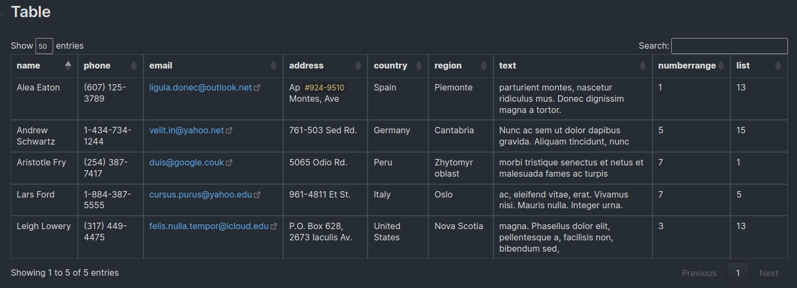

# Table plugin

For each table, the plugin adds new functions:
- sorting
- filtration
- search
- pagination

## Installation
Fix Require Modules is not available on the official [Community Plugins repository](https://obsidian.md/plugins) yet.
Beta releases can be installed through [BRAT](https://github.com/TfTHacker/obsidian42-brat)

## Use

In view mode, click anywhere on the table
